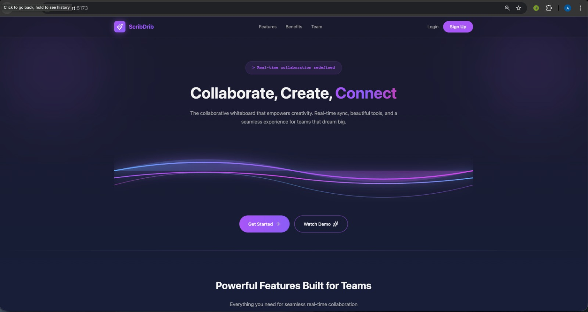
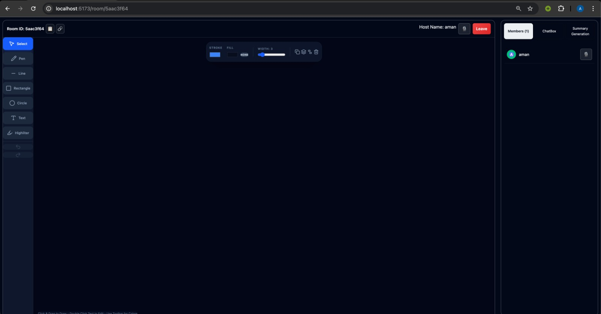
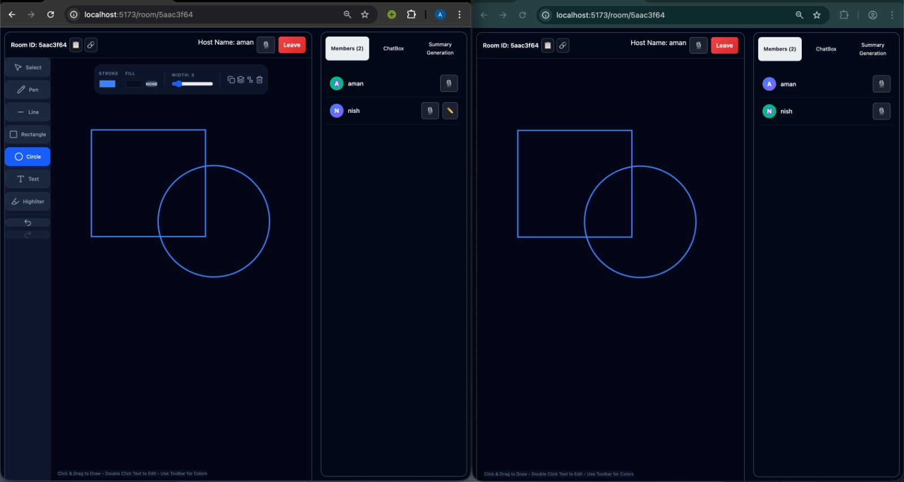

# Mente Colectiva - Real-time Collaborative Whiteboard

A modern, real-time collaborative whiteboard application built with the MERN stack, featuring instant synchronization, interactive drawing tools, and seamless team collaboration.


## 🌟 Features

### Core Functionality
- **Real-time Collaboration**: Instant canvas synchronization across all connected users using Socket.IO
- **Advanced Drawing Tools**: 
  - Pen/Pencil with customizable stroke width and color
  - Shapes (Rectangle, Circle, Line)
  - Text tool with inline editing
  - Highlighter/Eraser functionality
- **Object Manipulation**: Select, move, resize, rotate, duplicate, and delete objects
- **Grouping**: Group and ungroup multiple objects for easier management
- **Undo/Redo**: Complete history management with up to 50 states
- **Permission System**: Host can grant/revoke drawing permissions to specific users
- **Live Chat**: Built-in chat system with message history
- **AI-Powered Summary**: Generate intelligent summaries of whiteboard content using Google Gemini AI
- **Session History**: Access and view past whiteboard sessions
- **PDF Export**: Download whiteboard sessions as PDF files

### User Management
- **JWT Authentication**: Secure user authentication with bcrypt password hashing
- **Room System**: 
  - Create unique rooms with custom names
  - Join rooms via unique 8-character room IDs
  - Share room links for easy access
- **User Presence**: See who's online and track active participants
- **Host Controls**: Room creator has special privileges for permissions and room management

### Technical Features
- **Responsive Design**: Works seamlessly on desktop and mobile devices
- **Auto-save**: Continuous board state saving with debouncing
- **Session Persistence**: Board data stored in MongoDB for 30 days
- **Real-time Sync**: Zero-latency updates using WebSocket connections
- **Optimized Rendering**: Efficient canvas rendering with Fabric.js

## 🚀 Tech Stack

### Frontend
- **React** - UI framework
- **Fabric.js** - Canvas manipulation and rendering
- **Socket.IO Client** - Real-time communication
- **React Router** - Client-side routing
- **Tailwind CSS** - Styling framework
- **Axios** - HTTP client
- **React Toastify** - Notification system

### Backend
- **Node.js** - Runtime environment
- **Express.js** - Web framework
- **Socket.IO** - WebSocket server
- **MongoDB** - Database
- **Mongoose** - ODM for MongoDB
- **JWT** - Authentication tokens
- **bcryptjs** - Password hashing
- **Google Gemini AI** - AI summary generation

## 📋 Prerequisites

- Node.js (v20.0.0 or higher)
- MongoDB (local or Atlas)
- npm or yarn package manager

## 🛠️ Installation

### 1. Clone the Repository
```bash
git clone https://github.com/AmanMishra2003/Mente Colectiva.git
cd Mente Colectiva
```

### 2. Backend Setup
```bash
cd backend
npm install
```

Create a `.env` file in the backend directory:
```env
PORT=3000
DATABASEURL=your_mongodb_connection_string
JWTSECRET=your_jwt_secret_key
GEMINIAPIKEY=your_google_gemini_api_key
```

### 3. Frontend Setup
```bash
cd frontend/Mente Colectiva
npm install
```

Create a `.env` file in the frontend directory:
```env
PROD=false
VITE_SERVER_URL=http://localhost:3000
```

For production:
```env
PROD=true
VITE_SERVER_URL=your_production_backend_url
```

### 4. Run the Application

**Development Mode:**

Terminal 1 (Backend):
```bash
cd backend
npm start
```

Terminal 2 (Frontend):
```bash
cd frontend/Mente Colectiva
npm run dev
```

The application will be available at `http://localhost:5173`

## 📖 Usage Guide

### Creating a Room
1. Sign up or log in to your account
2. Click "Create Room" from the home page
3. Enter a room name
4. Share the generated room ID or link with collaborators

### Joining a Room
1. Click "Join Room"
2. Enter the room ID or use a shared link
3. Start collaborating immediately

### Drawing Tools
- **Select (V)**: Click to select and manipulate objects
- **Pen**: Freehand drawing
- **Shapes**: Create rectangles, circles, and lines
- **Text**: Click to add and edit text
- **Highlighter**: Semi-transparent drawing tool

### Keyboard Shortcuts
- `Ctrl/Cmd + Z`: Undo
- `Ctrl/Cmd + Y`: Redo
- `Ctrl/Cmd + D`: Duplicate selected object
- `Delete/Backspace`: Delete selected object

### Permission Management
- Host can toggle drawing permissions for individual users
- Users with permission see full toolbar; others have read-only access

### AI Summary
1. Click "Summary Generation" tab in the right panel
2. Click "Generate Summary" button
3. AI will analyze the whiteboard and provide:
   - Description of visual elements
   - Possible interpretations and meanings
   - Structured insights in formatted text

### Viewing History
1. Navigate to History page from navbar
2. View "Created by Me" and "Joined by Me" tabs
3. Click "Open" to view past sessions
4. Download sessions as PDF using the download button

## 🏗️ Project Structure

```
Mente Colectiva/
├── backend/
│   ├── middleware/
│   │   ├── authorization.js      # JWT middleware
│   │   ├── socketAuth.js         # Socket authentication
│   │   └── watchRoomDelete.js    # Room cleanup
│   ├── models/
│   │   ├── authModel.js          # User schema
│   │   ├── roomModel.js          # Room schema
│   │   └── comments.js           # Chat schema
│   ├── Router/
│   │   ├── authRouter.js         # Auth routes
│   │   ├── historyRouter.js      # History routes
│   │   └── summaryRouter.js      # AI summary routes
│   └── index.js                  # Server entry point
│
└── frontend/Mente Colectiva/
    ├── src/
    │   ├── API/
    │   │   └── axios.js          # API configuration
    │   ├── components/
    │   │   ├── AuthComponents/   # Login/Signup
    │   │   ├── Home/             # Landing page
    │   │   ├── HistoryPage/      # Session history
    │   │   ├── roomoptions/      # Room creation/joining
    │   │   └── WhiteBoardLibrary/# Whiteboard logic
    │   ├── Socket/
    │   │   └── ws.js             # Socket.IO client
    │   └── App.jsx               # Main app component
    └── public/
```

## 🔒 Security Features

- JWT-based authentication
- Password hashing with bcrypt
- Protected routes and middleware
- Socket.IO authentication
- CORS configuration
- Input validation and sanitization

## 🤝 API Endpoints

### Authentication
- `POST /auth/signup` - User registration
- `POST /auth/login` - User login

### History
- `GET /history` - Get user's room history
- `GET /history/:id` - Get specific room data

### Summary
- `POST /summary/:id` - Generate AI summary for room

### Socket Events
- `createRoom` - Create new room
- `joinRoom` - Join existing room
- `board:update` - Canvas state updates
- `chat:send` - Send chat message
- `permission:update` - Update user permissions

## 🌐 Deployment

The application is deployed at: [https://scrib-drib-bnqh.vercel.app](https://scrib-drib-bnqh.vercel.app)

**Backend**: Render/Railway
**Frontend**: Vercel
**Database**: MongoDB Atlas

## 👥 Team

## 📄 License

This project is licensed under the **GNU General Public License v3.0**  
See the full license here:  
👉 https://www.gnu.org/licenses/gpl-3.0.en.html


## 🐛 Known Issues & Limitations

- Maximum 50 undo/redo states
- Room data expires after 30 days
- PDF export limited to current canvas view
- Real-time sync requires stable internet connection

## 🔮 Future Enhancements

- Voice/Video chat integration
- Canvas templates library
- Export to multiple formats (PNG, SVG, JSON)
- Collaborative cursors
- Advanced shape library
- Whiteboard recording and playback
- Mobile app development

## 🖼️ Project Preview


###

###

###

---

